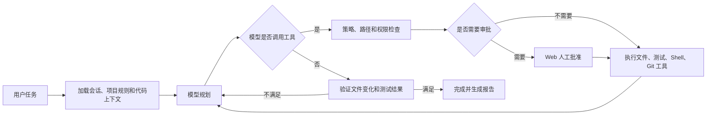

# DevPilot 原生工具与真实 Agent 缺口分析

> 记录时间：2026-07-31（Asia/Shanghai）
>
> 依据：代码审计，以及使用 `deepseek-openai / deepseek-v4-flash` 完成的真实 FastAPI
> 会话运行测试。

## 结论

DevPilot 有原生 Tools，不需要推倒重写。当前问题是这些组件没有连接成真正的 Agent
闭环。

现有能力如下：

| 能力 | 当前状态 |
|---|---|
| `file.read` | 可读取已有文本文件 |
| `file.search` | 可搜索工作区文件 |
| `file.patch` | 可修改已有文件，不能创建文件 |
| `shell.exec` | 可执行白名单命令，需要审批 |
| `git.exec` | 支持 status、diff、commit、push 等 |
| 路径隔离 | 已有，限制在 workspace 内 |
| 权限能力 | 已有 `workspace.read/write` 等 |
| 审批和审计 | 已有基础实现，但主要在内存 |
| Checkpoint | 有基础实现 |
| 仓库扫描、测试编排、Worktree | 已实现为独立服务 |
| 多模型设置 | 已实现 |
| 模型自主调用工具 | 没有 |
| 模型—工具循环 | 没有 |
| 项目上下文自动注入 | 没有 |
| 真实完成验证 | 没有 |

`/api/v1/tools` 当前只展示工具定义，并没有把它们真正交给模型。

Coding Plan 目前也只是一个 OpenAI-compatible 供应商类型。它能否成为 Coding Agent，
仍取决于具体模型是否支持 Tool Calling，以及下面的 Agent 闭环是否完成。

## 真实测试证据

测试在空目录
`.devpilot/agent-e2e/deepseek-event-lens` 中进行，调用链包含登录、注册项目、创建会话、
指定 DeepSeek、运行 Agent、读取运行日志和检查文件系统。

| 项目 | 结果 |
|---|---|
| 供应商与模型 | `deepseek-openai / deepseek-v4-flash` |
| 追踪标记 | `DP-AGENT-E2E-20260731-01` |
| Run ID | `656fcf55-215a-4900-b50a-0d130c4c1186` |
| API 结果 | HTTP 201，`completed` |
| DeepSeek 输出 | 返回了完整 Python 项目代码文本 |
| Tool 事件 | 0 |
| 实际生成文件 | 0 |
| 实际执行测试 | 0 |
| DevPilot Token 记录 | 没有 |

这不是 URL、API Key 或模型名称错误。模型请求已经成功，问题发生在 DevPilot 的 Agent
编排层：系统把模型输出的一段代码文本错误地当成了任务完成。

## 当前错误流程

1. API 成功选择模型。
2. API 创建 `RunRequest`，但没有提供可由模型自主选择的工具。
3. LangGraph 发现预填充的 `tool_calls` 为空。
4. Graph 跳过工具节点，直接调用模型。
5. DeepSeek 在聊天回复中输出代码。
6. `finalize` 只要得到模型文本便返回 `completed`。
7. 系统没有检查文件变化、测试结果或用户验收条件。

关键代码位置：

- `apps/api/main.py` 中的 `RunCreateRequest` 不包含 Agent 工具权限和执行目标。
- `apps/api/main.py` 创建 `AgentRuntime` 时没有注入项目级 `ToolRuntime`。
- `apps/api/main.py` 创建 `RunRequest` 时没有传递工具定义、项目上下文或历史消息。
- `packages/agent_core/graph.py` 只在请求已预填 `tool_calls` 时进入工具节点。
- `packages/model_gateway/adapters.py` 没有把 `ChatRequest.tools` 绑定给 LangChain 模型，
  也没有规范化模型返回的 Tool Call。
- `packages/contracts/agent.py` 的 `ChatResponse` 和 `ModelStreamEvent` 没有 Tool Call 字段。
- `packages/tool_runtime/tools.py` 的 `file.patch` 要求目标文件已经存在。

## 真实可用的目标流程



## 必须补齐的能力

### 1. 模型原生 Tool Calling

- 为 `ChatResponse` 和流式事件增加标准化 `tool_calls`。
- 把 `ToolDefinition` 转换成 OpenAI/Anthropic Tool Schema。
- OpenAI-compatible 模型使用原生 `tools` 或 LangChain `bind_tools`。
- Anthropic-compatible 模型解析 `tool_use` 内容块。
- 处理流式工具参数分片和 JSON 拼接。
- 不支持工具的模型必须返回明确错误，不能静默退化为普通聊天。

### 2. Agent 循环

将图改造成：

```text
context → model → route → tools/approval → model → verify → finalize
```

- 工具调用不再由 API 请求预先填写。
- 模型可以连续调用多个工具。
- 工具结果必须以标准 Tool Message 返回模型。
- 设置最大轮数、Token、时间和工具次数。
- 检测重复调用和无进展循环。
- 只有满足验收条件才能进入 `completed`。

### 3. 编程所需工具

除现有五个工具外，至少需要：

- `file.list`
- `file.write`
- `file.mkdir`
- `file.delete`
- `file.diff`
- `test.run`
- `repo.scan`
- `workspace.status`

同时必须让非零 Shell/Test 返回码成为失败结果，并确保所有工具都以会话关联项目的
`project.root_path` 为隔离边界。

### 4. 项目上下文

每次运行自动加载：

- 会话历史及摘要；
- 项目根目录；
- `AGENTS.md`、`CLAUDE.md` 和 `.devpilot/PROJECT.md`；
- 仓库语言、框架、入口和测试命令；
- Git 状态和已有用户变更；
- 用户记忆、项目记忆、附件；
- 当前允许的模型、工具和权限。

### 5. 持久化、审批和 Web

- 将 `RunRepository`、持久化 Checkpoint 和审计记录接入真实运行。
- 服务重启后恢复等待审批或暂停的任务。
- Web 显示计划、模型、工具参数、输出、Diff 和测试结果。
- Web 提供批准、拒绝、取消和重试。
- 对测试提供专用受控工具；安装依赖、删除、推送和外部副作用继续审批。

### 6. 完成验证

服务器独立检查：

- 是否产生预期文件；
- 是否存在有效 Diff；
- 测试是否真实运行且返回码为零；
- 是否仍有工具错误；
- 用户验收条件是否满足。

最终报告必须包含模型、请求 ID、Token、耗时、文件变化、命令、测试、风险和未完成项。

## 正确的优先级

最优先完成“模型 Tool Calling → Agent 循环 → 项目级工具”三个基础能力。单 Agent
闭环稳定后，再继续多 Agent、MCP、自动 PR 和更复杂的 Coding Plan 调度。

当前最重要的目标不是增加更多模型或更多 Agent，而是让一个 DeepSeek Agent 能可靠、
安全、可验证地完成一次真实代码任务。
