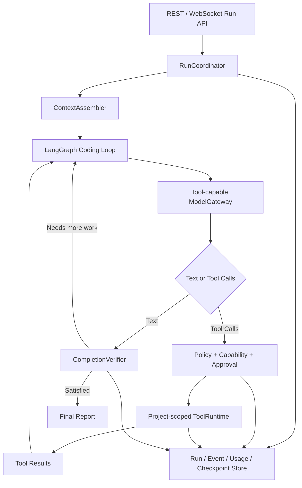

# DevPilot 真实编程 Agent 完整改造计划

> 执行性质：发布前纠偏与核心能力补全
>
> 目标：在一个连续执行周期内完成全部修复，但按可验证子批次依次提交
>
> 首要真实验收：让 DeepSeek 通过 DevPilot 自主在空目录创建项目、运行测试并形成完整审计链
>
> 问题依据：[原生工具与真实 Agent 缺口分析](REAL_AGENT_GAP_ANALYSIS.md)

## 1. 给下一对话的任务定义

下一位 Agent 必须从本文件开始工作，不得把当前代码中已有的接口、数据类、测试桩或
确定性元数据误认为真实能力。任务不是继续补演示页面，也不是让模型在聊天中输出代码，
而是完成一个安全、可恢复、可观察的编程 Agent 闭环。

本计划要求在同一个对话中持续执行 R1～R7。每个子批次必须独立实现、测试、更新文档并
创建 Git 提交；前一个子批次验收通过后立即进入下一个，不需要等待用户确认。只有发生
必须由用户授权的外部副作用、真实凭据失效或无法绕过的外部环境阻塞时才能暂停。

用户已经允许使用本机忽略文件 `.devpilot/settings.json` 中的 DeepSeek 测试配置进行
必要的真实请求。不得打印、复制、提交或写入文档中的 API Key。真实调用应控制数量，
优先使用 flash 模型完成协议冒烟，复杂规划才使用 pro 模型。

## 2. 最终完成定义

只有同时满足以下条件，才能报告“真实 Agent 改造完成”：

1. 用户在 Web/API 中选择一个已注册项目和允许模型范围后，可以提交自然语言编码任务。
2. 模型能看到经过策略过滤的工具定义，并自主产生原生 Tool Call。
3. Agent 能读取、创建、修改项目文件，并将 Tool Result 返回模型继续推理。
4. Agent 能通过专用测试工具执行测试，看到失败结果，修改代码并重试。
5. 高风险命令会暂停并要求审批；批准、拒绝和重启恢复均有效。
6. 项目目录、规则、会话历史、仓库画像和已有用户变更会进入上下文。
7. 系统以文件变化和测试证据决定完成状态，模型自称完成不构成完成。
8. 运行记录包含模型、供应商请求 ID、Token、耗时、工具、审批、文件 Diff 和测试。
9. DeepSeek OpenAI-compatible 协议通过真实空目录建项目端到端测试。
10. DeepSeek Anthropic-compatible 协议至少通过真实 Tool Calling 冒烟测试。
11. 完整 pytest、Ruff、Web production build、doctor 和安全检查通过。
12. 代码、测试、迁移、README/架构/进度/交接文档全部提交，工作区没有相关未提交变更。

以下情况一律不能算完成：

- 模型只在回复里给出代码块；
- 工具调用由测试或 API 预先硬编码，而不是模型生成；
- 手工代替 DeepSeek 往验收目录写代码；
- 没有真实运行测试却声称测试通过；
- 只验证 FakeModel；
- 只实现非流式协议，WebSocket 主链仍然不能使用；
- 遇到失败后静默回退成普通聊天；
- API 返回 `completed`，但没有满足服务器端验收条件。

## 3. 当前可复用基础

不要重写以下已经可复用的模块：

- `packages/tool_runtime/`：注册表、路径策略、能力校验、审批和审计基础。
- `packages/agent_core/`：LangGraph 生命周期、事件、暂停/恢复和 Checkpoint 基础。
- `packages/model_gateway/`：多供应商注册、OpenAI/Anthropic LangChain 适配器。
- `packages/project_context/`：项目规则发现。
- `packages/repo_intel/`：仓库画像和命令发现。
- `packages/memory/`：会话和长期记忆。
- `packages/persistence/`：Run/Event/Checkpoint 的数据库仓储基础。
- `packages/test_orchestrator/`：测试计划和执行基础。
- `packages/dev_workflows/`：Worktree、Agent 角色契约和 PR 文档基础。
- `apps/api/`、`apps/web/`：认证、RBAC、会话和 WebSocket 基础。
- `packages/local_settings.py`：多 endpoint、模型允许范围和环境变量回退。

改造原则是连接并加强这些模块，而不是另建一套绕过现有契约的 Agent。

## 4. 目标架构



必须保持供应商无关边界：Agent Graph 只消费标准化 Tool Call/Result，不直接解析
OpenAI 或 Anthropic 私有响应。

## 5. R1：供应商无关的 Tool Calling 协议

### 5.1 契约

在 `packages/contracts/` 中完成：

- 新增标准化 `ModelToolCall`，至少包含 `call_id`、`name`、`arguments`。
- `ChatResponse` 增加 `tool_calls`。
- `ModelStreamEvent` 支持工具名称、参数分片、完成标记和响应元数据。
- 区分文本结束、工具调用结束、长度限制和供应商错误。
- 保持旧文本响应的兼容读取。
- Tool arguments 必须经过 Pydantic/JSON Schema 验证，禁止容错执行畸形 JSON。

### 5.2 OpenAI-compatible 适配

在 `packages/model_gateway/adapters.py` 中：

- 把 `ChatRequest.tools` 转换为 LangChain/OpenAI tools。
- 使用 `bind_tools` 或等价原生调用，不能只在 metadata 中携带。
- 非流式响应解析 `AIMessage.tool_calls`。
- 流式响应按 call ID/index 合并工具名称与 arguments chunks。
- 保留 provider request ID、finish reason、usage metadata 和原始 model name。

### 5.3 Anthropic-compatible 适配

- 转换 Anthropic tool schema。
- 解析 `tool_use` 内容块及流式 JSON 参数。
- Tool Result 使用 Anthropic 能接受的对应消息结构。
- 不假定所有自定义 Anthropic URL 都支持完全相同的扩展字段。

### 5.4 能力探测

- endpoint 增加工具能力探测结果：`supported`、`unsupported`、`unknown`。
- `unknown` 可以执行显式冒烟；确认不支持后不得继续派发编码任务。
- Coding Plan 继续作为兼容协议，不硬编码某个厂商 URL。

### 5.5 R1 测试与验收

- Fake LangChain 模型返回单工具、多工具和分片 arguments。
- 畸形 JSON、缺失工具名、重复 call ID 被拒绝。
- OpenAI 与 Anthropic 适配器契约测试。
- DeepSeek 两种协议分别进行一个只读 `file.read` 真实 Tool Call 冒烟。
- 冒烟结果必须能证明 Tool Call 来自模型，而不是请求预填充。

提交建议：`feat: add provider-neutral model tool calls`

## 6. R2：LangGraph 自主工具循环

### 6.1 图状态

扩展 `AgentState`：

- `iteration`
- `max_iterations`
- `tool_calls`
- `tool_results`
- `consecutive_no_progress`
- `token_usage`
- `tool_call_count`
- `workspace_snapshot`
- `acceptance_criteria`
- `verification`
- `stop_reason`

### 6.2 节点与路由

目标节点：

1. `load_context`
2. `normalize_input`
3. `plan`
4. `call_model`
5. `route_model_output`
6. `request_approval`
7. `execute_tools`
8. `record_workspace_change`
9. `verify`
10. `compact_context`
11. `finalize`

正确循环：

```text
call_model
  ├─ tool_calls → execute_tools/approval → append tool messages → call_model
  └─ text       → verify
                    ├─ unmet → append verification feedback → call_model
                    └─ met   → finalize
```

### 6.3 预算与停止条件

服务器端硬限制至少包括：

- 默认最大 20 个模型回合；
- 默认最大 60 个工具调用；
- 单次运行 Token 上限；
- 单次运行墙钟时间上限；
- 连续三次相同工具、相同参数和相同结果时终止；
- 连续无文件变化且验证未改善时终止；
- 用户取消立即停止后续工具；
- 超限返回 `partial` 或 `failed`，不能返回 `completed`。

预算可以由管理员收紧，模型和普通用户不能放宽服务端上限。

### 6.4 R2 测试与验收

- 模型自主选择只读工具并得到结果。
- 模型连续执行“读 → 改 → 测”。
- 多工具调用保持 call ID 对应。
- 工具失败后模型可以修正参数重试。
- 审批 interrupt 后从同一 Checkpoint 恢复。
- 重复调用和预算超限安全终止。
- 无 Tool Call 的普通问答仍能正常完成。

提交建议：`feat: add iterative agent tool loop`

## 7. R3：项目级编程工具与安全边界

### 7.1 新工具

在 `packages/tool_runtime/` 中新增：

| 工具 | 用途 | 默认风险 |
|---|---|---|
| `file.list` | 有界文件树和元数据 | read-only |
| `file.write` | 创建文件或受控覆盖 | recoverable-write |
| `file.mkdir` | 创建目录 | recoverable-write |
| `file.delete` | 删除文件/空目录 | high-risk 或显式审批 |
| `file.diff` | 查看本轮 Diff | read-only |
| `workspace.status` | 新增、修改、删除摘要 | read-only |
| `repo.scan` | 获取仓库画像、规则和命令 | read-only |
| `test.run` | 运行发现或批准的测试命令 | sandboxed/controlled |

`file.write` 必须支持 `create_only`、`overwrite`、`expected_sha256` 和最大大小限制，避免
模型无条件覆盖用户文件。`file.delete` 不允许递归删除任意目录。

### 7.2 ToolRuntime 作用域

- 每个 Run 根据 Session 的 `project_id` 解析项目。
- `ToolRuntime.workspace_root` 必须是 `ProjectRecord.root_path`。
- 项目访问继续经过现有 RBAC。
- 不得使用 `project_root()` 把 DevPilot 自身仓库作为所有项目的工具根目录。
- 工具上下文记录 actor、session、run、project 和有效 capabilities。
- 一个 Worktree 同一时间只能有一个写入者。

### 7.3 Shell 与测试安全

当前 Shell 只检查可执行文件名，仍可能通过参数访问项目外路径。必须：

- 校验 cwd 和已识别路径参数；
- 使用最小环境变量，继续排除 API Key 和用户 Secrets；
- 禁止 shell 字符串，保持 argv 数组；
- 命令超时后终止整个子进程树；
- 限制输出和生成文件大小；
- 非零 return code 返回失败；
- 区分测试、静态检查、安装、网络和任意命令；
- `test.run` 只允许 RepositoryProfile 发现或管理员允许的命令；
- 安装依赖、外部网络、Git 写入和发布继续要求审批。

### 7.4 Windows 隔离

- 优先使用 Git Worktree 作为写入隔离。
- 子进程支持 Windows Job Object 或等价的进程树终止方案。
- 防止 junction、symlink 和大小写变化导致路径逃逸。
- Linux/macOS 继续通过平台端口保留 TODO，不能伪装成已验证。

### 7.5 R3 测试与验收

- 空目录能够创建嵌套目录和新文件。
- 已有文件基于 hash 的并发修改保护有效。
- 路径穿越、绝对外部路径、junction/symlink 逃逸被拒绝。
- 测试非零退出码形成失败 Tool Result。
- 超时命令不残留子进程。
- Git push、删除和安装依赖要求审批。

提交建议：`feat: add project-scoped coding tools`

## 8. R4：上下文组装、记忆和真实项目绑定

新增供应商无关 `ContextAssembler`，从应用层组装：

- 系统安全指令和 Agent 行为规则；
- 当前用户任务和显式验收条件；
- 会话历史、摘要和最近 Tool Result；
- 项目路径，但在发给远程模型时避免泄漏不必要的绝对宿主信息；
- 项目规则及其来源和优先级；
- RepositoryProfile：语言、框架、文件、符号、命令、Git 状态；
- 当前工作区用户未提交变化；
- 用户和项目记忆；
- 附件的安全引用；
- 允许模型、工具、capabilities、审批策略和剩余预算。

要求：

- `create_run` 和 WebSocket 使用同一个 RunCoordinator，不复制构建逻辑。
- 恢复完整会话，而不是每次只发送本轮用户消息。
- 根据 Token 预算裁剪；规则、安全约束和当前 Diff 不得被摘要丢失。
- 工具读取采用按需检索，不把整个仓库一次性发给模型。
- 模型输入中明确要求保护现有未提交修改。

R4 验收：

- Agent 会主动读取并遵守 `AGENTS.md`。
- 第二轮知道第一轮已经修改的文件。
- 注册项目与实际工具根目录完全一致。
- 大仓库上下文不会超预算。
- 未授权用户无法借会话访问项目。

提交建议：`feat: assemble project-aware agent context`

## 9. R5：持久化运行、审批与 Web 工作台

### 9.1 数据与恢复

- 把 `RunRepository`、持久化 Checkpoint 和 Audit Repository 注入真实 AgentRuntime。
- 增加必要 Alembic 迁移：usage、provider request ID、tool call/result、approval、verification、
  workspace change 和 stop reason。
- Run/Event 序列必须幂等，重连 WebSocket 不重复执行工具。
- 服务重启后可以恢复 `paused`、`waiting_approval` 和安全的 `running` 状态。
- API 返回 run ID 后应支持后台运行、查询、取消和继续，而不是强制一个 HTTP 请求等待到底。

### 9.2 API

至少提供：

- `POST /sessions/{id}/runs`
- `GET /runs/{run_id}`
- `GET /runs/{run_id}/events`
- `POST /runs/{run_id}/cancel`
- `POST /runs/{run_id}/resume`
- `POST /runs/{run_id}/approvals/{request_id}`
- `GET /runs/{run_id}/changes`
- `GET /runs/{run_id}/usage`

REST 与 WebSocket 必须共享同一权限、模型选择和运行服务。

### 9.3 Web

Web 必须显示：

- 当前计划和正在执行的步骤；
- 实际 endpoint/model 和自动选模原因；
- 每次模型调用的状态，而不显示 Secret；
- Tool Call 参数的安全摘要和 Tool Result；
- 审批卡片；
- 文件新增/修改/删除和 Diff；
- 测试命令、返回码、stdout/stderr；
- Token、耗时和预算；
- 取消、批准、拒绝、重试和继续。

页面刷新或服务重启后仍能恢复这些内容。

R5 验收：

- 高风险工具在 Web 暂停并成功批准/拒绝。
- 重启后等待审批仍存在。
- 重连不会重复写文件。
- 普通成员不能批准超出其项目权限的操作。

提交建议：`feat: persist and operate agent runs`

## 10. R6：服务器端完成验证和纠错

新增 `CompletionVerifier`，不能信任模型自报结果。

### 10.1 通用检查

- 本轮是否有预期类型的工作区变化；
- 是否存在未处理 Tool Error；
- 是否执行了要求的测试；
- 测试退出码是否为零；
- 文件是否仍位于项目范围；
- 用户明确要求的文件、命令或行为是否满足；
- 是否破坏已有测试或用户文件；
- 是否有未经批准的副作用。

### 10.2 任务状态

建议状态：

- `completed`：验收条件和必需验证全部满足；
- `partial`：产生可用成果，但预算耗尽或仍有明确未完成项；
- `waiting_approval`：需要人工决定；
- `failed`：无法继续、验证失败或安全策略拒绝；
- `cancelled`：用户取消。

如果为了兼容不新增枚举，也必须以结构化 `stop_reason` 区分，不能把 partial 映射为
completed。

### 10.3 自动纠错

- 验证失败以结构化反馈返回模型。
- 默认最多两轮有进展的修复重试。
- 测试输出过长时保存 Artifact，并返回失败摘要和关键行。
- 相同失败重复两次后停止，避免烧 Token。

R6 验收：

- 目录仍为空时绝不能完成。
- 模型声称“测试通过”但没有 `test.run` 证据时绝不能完成。
- 首轮测试失败、模型修复、次轮通过的任务可完成。
- 最终报告与持久化证据一致。

提交建议：`feat: verify agent task completion`

## 11. R7：可观测性、真实 E2E 与发布纠偏

### 11.1 Usage 与日志

每次模型调用持久化：

- endpoint ID、协议、请求模型、供应商返回模型；
- provider request ID；
- input/output/cache/total tokens（供应商提供多少记录多少）；
- 首 Token 延迟和总耗时；
- finish reason、重试次数和错误；
- 自动选模 selector 与最终执行模型；
- Tool Call 数、成功/失败数；
- 估算费用字段；未知价格时保持 `null`，不能猜测。

聚合到 Run 和 Session，但不能把 API Key 写入任何日志、metadata 或 Artifact。

### 11.2 Event Lens 强制真实验收

验收目录：

```text
.devpilot/agent-e2e/deepseek-event-lens
```

开始前可以清理该测试目录，但必须验证删除目标精确位于上述隔离目录。随后：

1. 通过真实 FastAPI/WebSocket 登录。
2. 注册该空目录为项目。
3. 创建关联 Session。
4. 手动指定 `deepseek-openai / deepseek-v4-flash`。
5. 提交任务：创建只使用 Python 标准库的 Event Lens JSONL 日志统计 CLI、README、
   示例和 unittest。
6. DeepSeek 必须通过模型生成的 `file.mkdir/file.write/test.run` Tool Call 自主完成。
7. DevPilot 自己不能代替 DeepSeek生成或写入项目代码。
8. 首次运行结束后检查文件、运行事件、Diff、测试证据和 Usage。
9. 使用同一 Session 提出一个增量修改，验证会话与项目上下文。
10. 再使用 Anthropic-compatible endpoint 做只读 Tool Call 冒烟，避免重复生成整个项目。

保存不含 Secret 的验收摘要到忽略目录：

```text
.devpilot/agent-e2e/results/<run_id>.json
```

摘要至少包含 run ID、request ID、模型、usage、工具顺序、变更文件和测试结果。

### 11.3 自动测试矩阵

必须覆盖：

1. 空目录创建项目。
2. 已有项目定位并修复真实 Bug。
3. 保留用户未提交变更。
4. 危险命令审批与恢复。
5. 路径逃逸和 Prompt Injection 拒绝。
6. 模型生成畸形工具参数。
7. 工具失败和测试失败重试。
8. 预算、取消、超时和重复循环。
9. 服务重启恢复。
10. REST/WebSocket 一致性。
11. OpenAI/Anthropic provider contract。
12. 自动选模只能在允许集合内。
13. API Key 不出现在日志、事件、数据库导出和 Git diff。

### 11.4 发布命令

每个子批次运行针对性测试；R7 最终必须运行：

```powershell
uv --cache-dir .uv-cache sync --group dev
uv --cache-dir .uv-cache run pytest
uv --cache-dir .uv-cache run ruff check .
uv --cache-dir .uv-cache run devpilot doctor
git diff --check
```

还必须运行当前仓库认可的 Vite production build，不得改用 npm 或创建第二套锁文件。

覆盖率要求：

- 领域代码至少 80%；
- 路径、审批、凭据、Tool Call 解析和恢复代码至少 90%。

若 Docker 在机器上可用，再完成：

```powershell
docker compose config
docker compose up --build -d
curl http://127.0.0.1:8000/healthz
curl http://127.0.0.1:8000/readyz
```

若 Docker 仍不存在，只能把“真实 Agent 纠偏”标记为完成；整个 B8 发布批次仍需保留
Docker 外部阻塞，不能虚报 B8 全部完成。

提交建议：`test: prove real coding agent end to end`

## 12. 模型与自动选模规则

- 用户手动指定模型时，Agent 的所有模型调用默认使用该目标。
- 自动模式可以为规划、实现、审查和总结选择不同模型，但每次都必须属于用户允许范围。
- 子 Agent 不能扩大 endpoint、模型或工具范围。
- 模型选择失败时只能回退到允许集合，并在 UI/日志中明确显示。
- Tool Calling 能力必须进入模型能力表；不支持工具的模型不能承担实现角色。
- selector 的 Token 也计入 Run Usage。
- Coding Plan 不获得特殊绕过；按其真实兼容协议和能力探测运行。

## 13. 安全红线

- 绝不提交 `.devpilot/settings.json` 或任何真实 Key。
- API Key 不进入 Prompt、Tool 环境、日志、事件、数据库普通 metadata 或错误栈。
- 工具只能在用户有权访问的项目内运行。
- 模型输出永远先经过 schema、策略、能力和路径检查。
- 不允许动态 import 模型指定的 Tool。
- 不允许模型放宽预算、审批和 capability ceiling。
- Git push、发布、安装、外部网络、删除和不可恢复操作必须审批。
- 不覆盖用户未提交修改；发生冲突时返回结构化阻塞。
- Prompt Injection 不能改变系统策略或扩大工具权限。
- 多 Agent 写入必须遵循“一 Worktree 一写入者”。

## 14. 文档和进度纠偏

实现过程中同步更新：

- 根 README：真实 Agent 使用、审批、日志和限制。
- `docs/GETTING_STARTED.md`：从注册项目到完成编码任务。
- `docs/LOCAL_SETTINGS.md`：模型工具能力探测和自动选模规则。
- 新增真实 Agent 架构文档和 API 文档。
- `docs/progress.json` 与 `docs/PROGRESS.md`。
- 最新 `docs/handovers/`。

原 B1、B2、B4 可以保留“组件实现完成”的历史事实，但发布进度必须明确：这些组件在本次
纠偏前没有形成模型驱动的真实编码闭环。

## 15. Git 和执行纪律

下一对话开始时：

1. 阅读根 `AGENTS.md`、`项目重写计划书.md`、本文件、`docs/PROGRESS.md` 和最新 handover。
2. 检查 `git status`，保护用户现有修改。
3. 运行基线 pytest、Ruff 和 doctor。
4. 从 R1 开始连续推进到 R7。

每个子批次：

1. 写清范围和验收。
2. 先补失败测试或契约测试。
3. 实现代码。
4. 运行针对性与完整相关测试。
5. 更新文档和进度。
6. `git diff --check`，检查 Secret 和运行时文件。
7. 创建对应 Git 提交。
8. 立即继续下一子批次。

最终：

1. 运行全部自动和真实 E2E 验收。
2. 确认 `git ls-tree -r --name-only HEAD docs/learn` 无输出。
3. 确认 `.devpilot/`、数据库、日志和 Key 未进入提交。
4. 生成最新 handover。
5. 创建最终验收提交。
6. 给用户报告真实结果、Run ID、工具链、测试、未完成外部阻塞和所有提交。

## 16. 新对话可直接使用的启动提示词

```text
请完整执行 docs/REAL_AGENT_IMPLEMENTATION_PLAN.md。

这是一次连续的真实 Agent 纠偏任务。请先阅读 AGENTS.md、项目重写计划书.md、
docs/REAL_AGENT_GAP_ANALYSIS.md、docs/REAL_AGENT_IMPLEMENTATION_PLAN.md、
docs/PROGRESS.md 和最新 handover，然后从 R1 连续实现到 R7。不要只写计划，不要停在
接口或测试桩，不要把模型输出代码文本当作工具执行成功。

每个 R 子批次都要实现、测试、更新文档并提交，然后自动继续下一批。使用本地忽略的
DeepSeek 设置完成必要的真实 Tool Calling 和空目录建项目验收，但绝不能打印或提交
API Key。最终必须让 DeepSeek 通过 DevPilot 自己生成 Tool Call，在隔离测试目录创建
Event Lens 项目并真实运行测试；DevPilot/Codex 不得代替 DeepSeek 往验收项目写代码。

除非需要新的外部授权、凭据已经失效，或同一个外部阻塞经过充分验证仍无法继续，否则
不要停下来询问我。完成前必须运行完整 pytest、Ruff、doctor、Web production build、
git diff --check、安全与凭据检查，更新 progress 和 handover，并创建对应 Git 提交。
```
