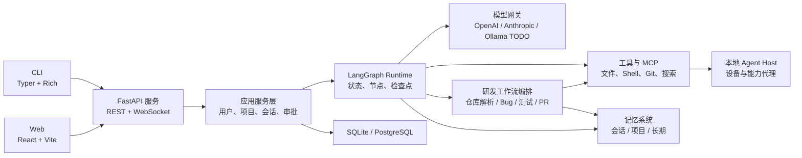
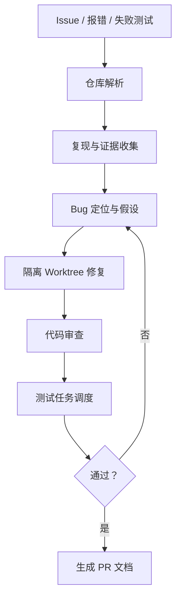

# CodeAssist 2.0 项目重写计划书

> 文档状态：需求确认稿  
> 编写日期：2026-07-28  
> 项目性质：完全重新设计，不复用旧项目架构，仅参考原有功能目标

## 1. 项目概述

CodeAssist 2.0 是一个面向开发者的多智能体研发助手，也是一个面向个人与团队的跨平台 AI 编程 Agent。除通用对话外，系统必须能够自动解析代码仓库、定位 Bug、创建隔离开发任务、调度测试、汇总证据并生成 PR 文档。项目采用本地优先、服务化内核设计，同一套 FastAPI Agent 服务同时为 CLI 和 Vite Web 工作台提供能力。系统支持 OpenAI、Anthropic API、多模态消息、工具调用、MCP、多 Agent、项目记忆、长期记忆、多用户、多项目、团队权限和会话共享。

首发运行方式为 Windows 上的本地 Web 服务；Linux 和 macOS 暂不作为当前阶段的功能验收平台，但必须通过平台无关契约、适配器接口和 CI 入口保留后续兼容路径。Vite Web 工作台实现本地或远程访问 Agent、项目文件、终端和审批流程。桌面画面、鼠标键盘及应用控制只预留安全接口和 TODO，不在首期实现。

## 2. 已确认需求与范围

### 2.1 必须实现

- 使用 Python 3.11+、LangChain 和 LangGraph 重写 Agent 内核。
- 使用 FastAPI 提供 REST API、WebSocket 流式事件和 OpenAPI 文档。
- 提供 CLI 和浏览器 Web 两种客户端。
- Web 工作台采用 React + TypeScript + Vite，由 FastAPI 在生产模式下托管构建产物；本地启动命令可自动打开默认浏览器。
- 支持 OpenAI 和 Anthropic API，统一处理文本、图片、PDF、音频等内容块；实际能力按所选模型动态判断。
- 为 Ollama 预留模型适配接口、配置模型和能力声明，本期不实现调用。
- 支持多用户、多项目、团队权限和会话共享。
- 支持短期会话记忆、项目记忆文件和跨会话长期记忆。
- 支持工具调用、MCP、人工审批、Trace 和 Git Worktree 隔离。
- 自动扫描代码仓库，识别语言、框架、入口、依赖、构建命令、测试命令和目录级规则。
- 面向 Issue、报错日志和失败测试，自动收集证据、定位可疑代码、复现问题并提出修复方案。
- 调度单元测试、集成测试、静态检查和自定义脚本，支持并行、超时、重试、取消和结果汇总。
- 根据实际变更自动生成 PR 标题、摘要、变更文件说明、测试结果、风险、回滚建议和检查清单。
- 当前阶段完整支持 Windows；Linux/macOS 通过平台适配接口、能力声明和 CI 配置保留兼容路径，后续再分别完成运行时验收。

### 2.2 本期不实现

- 桌面画面实时传输。
- 浏览器远程控制鼠标、键盘和本地 GUI 应用。
- Ollama 的实际推理调用与模型管理。
- 移动端客户端。
- 云厂商专属托管方案。

上述能力必须在领域模型、权限模型和通信协议中保留扩展点，但不得以未受控的通用命令接口代替。

## 3. 关键技术决策

| 领域 | 选择 | 说明 |
|---|---|---|
| Agent 框架 | LangChain + LangGraph | LangChain 负责模型、消息和工具抽象；LangGraph 负责持久状态、暂停恢复、流式事件和人工介入 |
| API 服务 | FastAPI + Uvicorn | 自主管理鉴权、会话、文件、设备与 WebSocket，不依赖已弃用的 LangServe |
| CLI | Typer + Rich | 提供脚本化命令与交互式终端界面 |
| Web | React + TypeScript + Vite | 浏览器工作台；开发期使用 Vite，生产期由 FastAPI 托管静态产物 |
| 本地启动 | FastAPI + CLI | 管理本地服务、工作目录和浏览器入口，不引入桌面原生壳层 |
| 数据访问 | SQLAlchemy 2 + Alembic | 支持 SQLite 与 PostgreSQL，迁移可追踪 |
| 数据库 | SQLite / PostgreSQL | 本地单机默认 SQLite；团队和远程部署使用 PostgreSQL |
| 实时通信 | WebSocket | 统一承载 Token、工具、审批、状态和错误事件 |
| 文件存储 | 本地对象目录，预留 S3 接口 | 保存附件、工具产物和导出文件 |
| 前端状态 | TanStack Query + Zustand | 服务端状态与本地 UI 状态分离 |
| 包管理 | uv + pnpm | Python 依赖仅由 uv 管理；`apps/web` 依赖由 pnpm 和根目录锁文件管理 |
| 测试 | pytest、Playwright、Vitest | 覆盖后端、协议、UI 和端到端流程 |

### 3.1 关于 LangServe

用户提到的 “langserver” 应为 LangServe。LangServe 已被官方弃用并归档，新项目不应建立在其上。本项目直接把 LangGraph 应用封装在 FastAPI 的服务层内，保留清晰的领域接口。未来若需要托管能力，可单独评估 LangGraph Platform，而不改写 Agent 核心。

## 4. 总体架构



### 4.1 部署形态

1. **本地模式**：CLI 启动本机 FastAPI 服务并打开 Vite 构建后的 Web 工作台；CLI 和浏览器访问同一服务。
2. **局域网模式**：一台主机运行 API 与 Agent Host，其他设备通过浏览器访问。
3. **团队服务模式**：FastAPI、PostgreSQL、对象存储分离部署；不同电脑运行受配对保护的 Agent Host。
4. **远程控制扩展模式**：服务端向指定 Host 派发经过鉴权、授权和人工审批的动作。首期仅支持 Agent 工具执行，不支持桌面控制。

## 5. 代码仓库规划

建议使用 Monorepo：

```text
codeassist-next/
├── apps/
│   ├── api/                     # FastAPI 入口、路由、中间件
│   ├── cli/                     # Typer CLI
│   ├── web/                     # React Web
├── packages/
│   ├── agent_core/              # LangGraph、状态、节点、策略
│   ├── repo_intel/              # 仓库扫描、代码索引、构建/测试发现
│   ├── dev_workflows/           # Bug 定位、修复、审查和研发流程图
│   ├── test_orchestrator/       # 测试计划、队列、执行和结果汇总
│   ├── pr_docs/                 # PR 标题、描述、风险和检查清单生成
│   ├── model_gateway/           # 模型适配器与能力表
│   ├── tool_runtime/            # 工具注册、权限、执行与 MCP
│   ├── memory/                  # 会话、项目和长期记忆
│   ├── project_context/         # 项目规则文件发现与合并
│   ├── remote_host/             # 本地设备代理；远程桌面仅留接口
│   ├── persistence/             # SQLAlchemy 模型与仓储
│   ├── contracts/               # API DTO、事件协议和错误码
│   └── ui/                      # Web 共享组件
├── migrations/                  # Alembic 迁移
├── tests/
│   ├── unit/
│   ├── integration/
│   ├── contract/
│   └── e2e/
├── docs/
│   ├── architecture/
│   ├── api/
│   ├── security/
│   └── adr/                     # 架构决策记录
├── scripts/
├── pyproject.toml
└── docker-compose.yml
```

领域包不得直接依赖 FastAPI、Vite 或具体数据库。客户端只调用公开 API，不直接操作 Agent 内部状态。研发工作流通过 `contracts` 交换结构化任务、证据、测试结果和 PR 文档，不把这些内容拼接成不可追踪的自然语言文本。

## 6. Agent 内核设计

### 6.1 LangGraph 主图

初始主图包含以下节点：

1. `load_context`：加载用户、团队、项目规则和长期记忆。
2. `normalize_input`：校验文本和多模态内容块。
3. `plan`：分析任务并生成可观察的执行计划。
4. `call_model`：通过模型网关调用选定模型。
5. `route_action`：判断直接回复、调用工具、委派子 Agent 或请求审批。
6. `request_approval`：使用 LangGraph interrupt 暂停并持久化状态。
7. `execute_tools`：在权限、路径和超时约束下执行工具。
8. `run_subagent`：创建限定目标、预算和工具范围的子图。
9. `compact_context`：按 Token 预算压缩历史，保留原始消息引用。
10. `persist_memory`：在策略允许时写入项目或长期记忆。
11. `finalize`：生成结果、产物索引、Trace 和使用量。

图状态必须使用明确的 TypedDict/Pydantic 契约，不把格式化后的 Prompt 当作状态源。每次运行使用 `thread_id` 和 `run_id`，支持取消、重试、暂停、恢复和幂等执行。

### 6.2 多 Agent

- 使用 Supervisor + 专用子 Agent 模式。
- 子 Agent 可分为代码检索、实现、测试、审查和研究等角色。
- 每个子 Agent 必须拥有独立消息区、工具白名单、Token/时间预算和工作目录。
- 并行任务使用 LangGraph 并行分支，汇总节点负责冲突检测和结果合并。
- 涉及文件修改时优先使用 Git Worktree；不得由多个 Agent 无隔离地修改同一文件。

本项目采用“中心化编排、按需派生、受限并行”的拓扑，不采用没有统一控制面的去中心化 Agent 网络。Supervisor 负责拆解任务、选择角色、发起委派和汇总结果；子 Agent 不直接向用户输出，不直接委派同级 Agent，默认只能向父运行返回结构化结果。所有副作用仍必须经过统一工具运行时和人工审批，不因处于 Supervisor 或子 Agent 角色而自动获得更高权限。

#### 6.2.1 Agent 生命周期与数量

- `AgentProfile` 是持久化的角色配置，不等同于正在运行的 Agent 实例。
- 每个用户任务创建一个 `WorkflowRun` 和一个顶层 Supervisor Run；Supervisor 只有在任务需要时才创建子 Agent Run。
- 子 Agent 以独立任务为单位按需创建，初始状态为 `pending`，随后进入 `running`、`paused`、`waiting_approval`、`completed`、`failed`、`cancelled` 或 `expired`。
- 等待审批、暂停或进程重启时必须保留 Checkpoint，不得销毁运行状态。
- 进入终态后释放模型上下文、进程、锁、Worktree 租约和其他运行资源；AgentRun、RunEvent、Checkpoint、审计日志与产物保留用于恢复、追溯和复盘。
- Agent 数量按运行时实例计算：`active_agent_count = 1 个 Supervisor + 当前活动子 Agent 数量`。角色定义不预先启动，也不要求所有专用角色同时存在。
- 初版服务端必须设置硬上限：`max_depth=1`、`max_concurrent_children=4`、单工作流总子 Agent 数量上限、单 Agent Token/墙钟时间预算和全局并发上限；这些限制不能由模型或用户输入放宽。
- 涉及写入时遵循“一个 Worktree 一个写入者”；只读扫描和测试可以并行，写入、合并和发布必须串行并经过汇总节点。

#### 6.2.2 Supervisor 委派与 Agent 参数

Supervisor 可以提出任务角色、目标、输入引用和工作量等级，但不能直接授予任意工具、路径、模型或系统权限。服务端必须将其提议编译为经过策略校验的 `AgentAssignment`，并取父任务授权、项目规则、角色上限和 Host 能力的交集。

每个 `AgentAssignment` 至少包含：

```text
parent_run_id, agent_role, objective, input_refs
model_profile, allowed_tools, capability_ceiling
worktree_path, max_tokens, max_wall_time
max_children, approval_requirements, isolation_mode
```

子 Agent 的权限不得超过父运行的有效权限；子 Agent 默认不可再次委派。若未来开放嵌套委派，必须单独设置深度、数量和预算递减规则，并在审计中记录完整父子链。

### 6.3 研发工作流编排

研发工作流是本项目区别于通用聊天 Agent 的核心能力。每个工作流都必须拥有 `workflow_id`、输入来源、状态、证据引用、工作树、预算、审批点和可重试边界。



#### 仓库解析 Agent

- 读取 Git 状态、分支、提交历史、子模块和 Worktree。
- 识别 Python、JavaScript/TypeScript、Rust、Go 等语言及其包管理文件。
- 发现 `pyproject.toml`、`package.json`、Makefile、CI 配置和测试配置中的命令。
- 构建文件树、符号索引、依赖图和可选的 Tree-sitter/LSP 语义索引。
- 读取 `AGENTS.md`、`CLAUDE.md`、`.codeassist/PROJECT.md` 等规则并记录来源。
- 输出 `RepositoryProfile`，供 Bug、实现、测试和 PR Agent 复用；重复运行必须增量更新。

#### Bug 定位 Agent

输入可以是用户描述、Issue、异常堆栈、日志、失败测试或截图。Agent 按“现象 → 复现 → 证据 → 假设 → 代码位置 → 修复 → 回归测试”推进：

- 先生成可验证的复现步骤，不直接根据单条错误消息猜测结论。
- 使用搜索、调用链、静态检查、Git 历史和测试结果建立证据链。
- 输出疑似文件、符号、行号、根因假设、置信度和未解决问题。
- 在独立 Worktree 中修改，并为每个修复生成回归测试或说明无法生成的原因。
- 自动修复只提交建议或待审变更，禁止默认直接合并或推送。

#### 测试调度 Agent

- 从仓库配置和 `RepositoryProfile` 发现测试命令与测试分层。
- 根据变更文件、依赖关系和规则选择最小测试集，再按策略追加完整测试。
- 使用 LangGraph `Send`/并行分支调度任务，记录队列、依赖、超时、重试和取消状态。
- 保存 stdout/stderr、退出码、覆盖率、失败用例、产物和环境信息。
- 失败时把结果回送 Bug 定位或修复 Agent；相同失败达到重试上限后停止循环并请求人工处理。

#### PR 文档 Agent

根据 Issue、Worktree diff、提交记录、测试事件和审查结果生成结构化 Markdown：

- PR 标题和一句话摘要。
- 背景、问题根因和解决方案。
- 变更文件/模块说明和数据库迁移说明。
- 测试命令、通过/失败结果、覆盖率和未运行测试。
- 兼容性影响、安全影响、风险、回滚方案和截图占位符。
- Reviewer 检查清单及需要人工确认的事项。

首期只生成和导出 PR 文档，不自动创建远程 PR；后续通过 GitHub/GitLab 适配器实现发布。

### 6.4 研发工作流数据契约

```text
RepositoryProfile       # 仓库语言、框架、命令、规则和索引版本
IssueContext            # 问题描述、日志、失败测试和附件
EvidenceItem            # 文件、行号、命令、日志片段和来源引用
BugHypothesis           # 根因、置信度、验证步骤和状态
DevelopmentTask         # Worktree、目标、预算、审批和子任务
AgentProfile            # 角色、提示词引用、模型策略、工具白名单和能力上限
AgentAssignment         # 父运行、目标、输入引用、模型、预算、Worktree 和审批要求
AgentRunState           # Agent 运行状态、父子关系、深度、取消和终止原因
TestPlan / TestTask     # 测试层级、命令、依赖、重试和超时
TestResult              # 退出码、日志、覆盖率、产物和失败摘要
PRDocument              # 摘要、变更、测试、风险和检查清单
```

这些对象都要进入数据库或事件日志，能够从 PR 文档中的每条结论追溯到对应的 diff、测试事件或仓库证据。AgentRun 必须记录 `agent_id`、`parent_run_id`、`workflow_id`、角色、实际模型、有效能力、Worktree、预算、状态转换和终止原因；不得只把父子关系和权限塞进不可查询的自然语言 Prompt。

### 6.5 模型网关

定义与供应商无关的 `ChatModelAdapter`：

```text
invoke(request) -> response
stream(request) -> async events
capabilities() -> text/image/audio/pdf/tools/structured_output
count_tokens(messages) -> usage
healthcheck() -> status
```

首期实现：

- `OpenAIAdapter`：基于 `langchain-openai`。
- `AnthropicAdapter`：基于 `langchain-anthropic`。
- `OllamaAdapter`：仅定义配置、能力和异常类型，方法返回“尚未实现”的明确错误。

模型配置不得散落在业务代码中。每个模型维护能力表，前端按能力决定是否显示附件类型、工具调用和结构化输出选项。

模型选择采用“角色策略 + 确定性策略路由”，不允许 Supervisor 或普通子 Agent 任意指定供应商和模型：

1. 用户、团队和项目策略先确定允许的供应商、模型档案、隐私级别和预算上限。
2. Agent 角色声明任务所需能力、上下文长度、结构化输出、工具调用、延迟和质量等级。
3. `ModelRouter` 过滤不满足能力、健康状态、数据策略或预算的候选模型。
4. 服务端依据成本、延迟、质量等级、当前负载和 fallback 顺序进行确定性排序，并将最终模型写入 AgentAssignment 和 Trace。
5. Supervisor 可以选择任务的角色和工作量等级，但只能在服务端批准的 `ModelProfile` 范围内选择；模型选择不能增加工具权限或绕过审批。

模型路由失败时必须返回明确的能力、预算或可用性错误，不得静默切换到违反用户、团队或项目策略的模型。

## 7. 多模态设计

统一消息内容块：

```text
TextBlock
ImageBlock(url | attachment_id, mime_type, detail)
AudioBlock(attachment_id, mime_type)
DocumentBlock(attachment_id, mime_type, filename)
ToolResultBlock
```

处理流程：

1. 客户端上传附件并获得 `attachment_id`。
2. 服务端校验 MIME、扩展名、大小、哈希和访问权限。
3. 模型网关根据供应商能力转换为 OpenAI 或 Anthropic 内容块。
4. 不支持的组合在调用前返回可理解的能力错误，不静默丢弃附件。
5. 会话只保存附件元数据和引用，原文件进入受控对象目录。

首期验收以文本、图片和 PDF 为主；音频建立完整协议并至少完成 OpenAI 可用模型的集成测试。视频只预留内容类型。

## 8. 记忆与项目上下文

### 8.1 四级记忆

| 层级 | 保存位置 | 用途 |
|---|---|---|
| 当前运行状态 | LangGraph Checkpoint | 工具进度、审批点、临时计划 |
| 会话记忆 | 数据库 | 消息、摘要、附件、共享状态 |
| 项目记忆 | 项目 Markdown + 数据库索引 | 架构、约定、命令、已知问题 |
| 用户长期记忆 | 用户 Markdown + Store | 跨项目偏好、习惯和稳定事实 |

### 8.2 记忆文件约定

按优先级发现并合并：

```text
用户目录/.codeassist/MEMORY.md        # 用户长期记忆
项目根目录/AGENTS.md                  # 通用 Agent 指令
项目根目录/CLAUDE.md                  # 兼容既有项目约定
项目根目录/.codeassist/PROJECT.md     # 项目说明
项目根目录/.codeassist/MEMORY.md      # 项目长期记忆
当前目录及父目录/AGENTS.md            # 目录级作用域规则
```

规则合并必须记录来源、作用域和优先级，遇到冲突时以更具体目录和显式用户指令为准。记忆写入采用“候选记忆 → 去重 → 敏感信息检查 → 用户策略判断 → 落盘”流程。默认不把 API 密钥、密码、身份令牌和一次性错误写入长期记忆。

项目记忆文件为人类可读的事实来源；数据库保存结构化索引、版本和检索向量。向量检索作为可替换接口，首期可使用简单关键词与结构化标签，避免过早绑定特定向量数据库。

## 9. 工具、MCP 与工作区安全

### 9.1 工具分类

- 只读：目录、文件、搜索、Git 状态。
- 可恢复写入：新建文件、补丁编辑、格式化。
- 高风险：Shell、删除、覆盖、移动、Git 提交与推送。
- 外部副作用：网络请求、MCP 写操作、远程设备动作。

每个工具声明输入输出 Schema、风险等级、所需能力、超时、并发策略、幂等性和审计字段。工具执行必须经过统一 `PolicyEngine`，不得由模型直接调用系统 API。

### 9.2 权限与审批

- 默认拒绝未声明能力。
- 项目路径使用规范化绝对路径和沙箱边界检查。
- Shell 使用参数化命令策略、环境变量白名单和输出限制。
- 高风险操作通过 LangGraph interrupt 等待用户批准。
- 审批可选择仅本次、当前会话或特定命令模式，不提供无限制永久授权。
- MCP 服务按服务器、工具和用户分别授权。

### 9.3 Agent 权能边界

Agent 的有效权能必须由服务端计算，不能由 Prompt、模型输出或客户端 metadata 自行声明：

```text
EffectiveCapabilities =
    UserCapabilities
    ∩ ProjectPolicy
    ∩ AgentCapabilityCeiling
    ∩ TaskGrant
    ∩ HostCapabilities
```

文件和 Worktree 范围也必须取交集：路径必须同时位于项目根目录、任务授权目录和 Agent 的 Worktree 范围内。每次工具调用都必须重新检查 Agent 身份、父运行、工具白名单、能力、路径、风险、预算和审批状态。

- Supervisor 默认拥有编排、读取状态和委派能力，不因“主 Agent”身份获得 Shell、写文件、Git 推送或远程设备权限。
- 子 Agent 默认只能访问自身 Assignment 中的工具和资源，不能扩大父任务授权，不能读取其他 Agent 的消息区或 Worktree。
- 工具执行上下文中的能力集合必须由 PolicyEngine 生成，禁止信任请求 metadata 中的能力字段。
- 高风险工具必须携带与具体调用、参数指纹、会话和 AgentRun 绑定的审批记录；审批只改变该调用的许可状态，不改变 Agent 的永久能力上限。
- 审计记录必须包含 `actor_id`、`agent_id`、`parent_run_id`、`run_id`、工具、参数摘要、策略决定、审批 ID、路径和结果。

## 10. API 与事件协议

### 10.1 REST 资源

```text
/api/v1/auth/*
/api/v1/users/*
/api/v1/teams/*
/api/v1/projects/*
/api/v1/sessions/*
/api/v1/runs/*
/api/v1/approvals/*
/api/v1/attachments/*
/api/v1/models/*
/api/v1/tools/*
/api/v1/mcp/*
/api/v1/devices/*
/api/v1/repositories/*
/api/v1/workflows/*
/api/v1/test-plans/*
/api/v1/test-tasks/*
/api/v1/pr-documents/*
```

### 10.2 WebSocket

连接形式：`/api/v1/ws?session_id=...`

事件统一包含：

```json
{
  "event_id": "uuid",
  "event_type": "model.token",
  "session_id": "uuid",
  "run_id": "uuid",
  "sequence": 42,
  "timestamp": "ISO-8601",
  "payload": {}
}
```

首期事件包括 `run.started`、`model.token`、`tool.requested`、`tool.output`、`approval.required`、`workflow.stage_changed`、`repository.scan_progress`、`test.task_queued`、`test.task_finished`、`pr.document_updated`、`state.updated`、`artifact.created`、`run.completed` 和 `run.failed`。客户端断线重连后按 `sequence` 补拉事件，避免消息重复或缺失。

## 11. 客户端规划

### 11.1 CLI

```text
codeassist chat [--project PATH] [--session ID]
codeassist run "任务" [--json]
codeassist sessions list|show|share
codeassist projects add|list|remove
codeassist models list|test
codeassist mcp list|add|remove|test
codeassist approvals list|approve|deny
codeassist repo scan [PATH]
codeassist bug locate "问题描述" [--issue FILE]
codeassist workflow status <id>
codeassist tests plan|run [--changed-only]
codeassist pr draft [--output FILE]
codeassist serve
codeassist doctor
```

CLI 同时支持交互模式、结构化 JSON 输出、管道输入、退出码和 Ctrl+C 取消。所有核心操作必须调用应用服务，不复制一套 Agent 逻辑。

### 11.2 Web

主要页面：

- 登录、设备配对和服务状态。
- 项目列表、成员和权限。
- 会话列表、会话共享和搜索。
- 对话工作台：流式内容、多模态附件、工具详情、审批卡片。
- 文件树、差异查看、终端输出和产物下载。
- Agent 执行图、子 Agent 状态与 Trace 时间线。
- 研发工作台：仓库扫描、Issue/日志输入、Bug 证据链和定位结论。
- 测试中心：测试计划、任务队列、并行执行、失败重试、日志和产物。
- PR 文档编辑器：自动生成内容、来源跳转、人工修改、导出和审核状态。
- 模型、MCP、工具策略和记忆管理。
- 远程设备列表；桌面控制入口标记为 TODO/实验功能。

### 11.3 本地 Web 运行模式

本地 Web 模式复用同一套公开 API，并提供：

- CLI 启停本地 FastAPI/Agent Host，并可自动打开默认浏览器。
- FastAPI 在生产模式下托管 Vite 构建产物，开发模式由 Vite 代理 `/api` 和 WebSocket。
- 项目目录由用户在 Web 表单中显式填写或从服务端允许的工作区中选择，后端执行规范化、存在性与授权校验。
- API 密钥由服务端凭据层加密保存；浏览器不得读取已保存的明文密钥。
- 日志、Trace 和产物通过受控 HTTP API 查看或下载。
- Web 前端不得获得任意 Shell 或文件系统权限，所有副作用继续经过策略、审批与审计。

## 12. 用户、团队与会话共享

角色建议：

- `owner`：团队、成员、密钥和策略管理。
- `admin`：项目、设备和共享管理。
- `member`：创建会话、运行 Agent、按策略使用工具。
- `viewer`：只读查看共享会话和产物。

资源权限按团队、项目、会话三级检查。会话共享支持私有、项目成员可见、指定用户可见和只读分享。API 密钥默认属于用户或团队的加密凭据，客户端永远不能读取明文。

## 13. 安全方案

建议首期纳入：

- 本地模式首次启动创建管理员；远程模式使用用户名/密码或可插拔 OAuth。
- 密码采用 Argon2id；短期 Access Token + 可撤销 Refresh Token。
- 浏览器使用安全 Cookie，CLI 使用设备授权令牌；禁止在 URL 中传长期 Token。
- 局域网与公网部署必须启用 HTTPS/WSS；反向代理终止 TLS。
- Agent Host 使用一次性配对码注册，生成可撤销设备凭据。
- RBAC、对象级授权和工具策略三层校验。
- API 密钥使用操作系统密钥库或服务端主密钥加密。
- 审计登录、共享、审批、工具、文件和设备动作。
- 请求限流、附件限额、超时、并发上限和紧急停止。
- Web 防护包含严格 CORS、CSRF、防 XSS、安全响应头和 WebSocket 鉴权。

公网远程控制功能在完成威胁建模、渗透测试和权限审计前不得默认开启。

## 14. 跨平台策略

### Windows

- 首发完整支持 Python 服务和主流浏览器。
- 使用 uv 同步环境，以 `codeassist serve --open-browser` 启动本地 Web 工作台。
- Shell 默认 PowerShell，保留 `cmd` 和 Git Bash 配置。
- 敏感凭据由服务端加密凭据层保存，不写入浏览器存储。

### Linux（后续兼容 TODO）

- 当前阶段不作为功能验收平台；保留 Ubuntu LTS 的 Python 服务、主流浏览器和 FastAPI + Vite 入口约定。
- 后续通过 POSIX 路径、进程、Shell 和浏览器适配器完成运行时验证，不要求 AppImage 或 `.deb`。
- Linux 专属实现必须位于平台适配层，不能把发行版命令写入领域核心。

### macOS（后续兼容 TODO）

- 使用 POSIX 路径抽象、跨平台进程接口和浏览器标准 API 保持兼容。
- CI 保留 Python、前端构建和 Web 契约测试入口；当前阶段不要求 macOS 原生安装包、签名或公证。
- 禁止在核心代码中硬编码 Windows 路径、PowerShell 或 Linux 专属命令。

## 15. 数据模型

核心实体：

```text
User, Team, TeamMember
Project, ProjectMember, ProjectRule
Session, SessionShare, Message, ContentBlock, Attachment
WorkflowRun, AgentProfile, AgentAssignment, AgentRun, RunEvent, Checkpoint, Approval
ToolDefinition, ToolPolicy, ToolExecution
ModelProvider, ModelProfile, ModelCapability
MemoryEntry, MemorySource, MemoryRevision
MCPServer, MCPTool
Device, DeviceCapability, DeviceCredential
AuditLog, Artifact
```

所有实体使用 UUID、创建/更新时间和可选软删除字段。消息、事件和检查点分表保存；禁止把完整会话塞入单个 JSON 字段。数据库迁移必须可回滚，并提供 SQLite 到 PostgreSQL 的导出导入工具。

## 16. 可观测性与质量

- 使用结构化 JSON 日志和贯穿 API、Graph、模型、工具的 `trace_id`。
- 记录 Token、延迟、重试、工具耗时和错误类型，不记录密钥与敏感正文。
- LangSmith 作为可选追踪适配器，不作为运行必需条件。
- 提供本地 Trace 页面和 JSON 导出。
- 使用 OpenTelemetry 接口预留日志、指标和链路导出。

测试门槛：

- 领域层单元测试覆盖率不低于 80%。
- 权限、路径、审批和凭据代码分支覆盖率不低于 90%。
- 模型使用假实现进行确定性测试；真实 API 测试由环境变量显式开启。
- OpenAI/Anthropic 多模态请求使用契约测试验证内容块转换。
- 当前阶段在 Windows 执行 CLI、API 和 Web 冒烟测试；Linux/macOS 运行时测试保留在后续 CI 任务。
- Playwright 覆盖登录、创建项目、发起会话、审批工具和共享会话。
- 使用固定样例仓库验证语言/框架/命令/规则解析结果和增量索引。
- 使用可复现的缺陷样例验证定位 Agent 能输出证据链、根因假设和回归测试。
- 使用假测试执行器验证并行、依赖、超时、重试、取消和失败回传。
- 使用固定 diff 和测试事件验证 PR 文档字段完整、来源可追溯且不泄露密钥。
- 使用固定任务验证 Supervisor 只创建按需子 Agent，Agent 树中的父子关系、数量、深度、预算和状态转换可追踪。
- 验证子 Agent 无法访问未分配的工具、路径、Worktree、消息区或模型档案，无法通过 metadata、Prompt 或工具结果提升权限。
- 验证暂停、审批、恢复、取消、超时和进程重启后，子 Agent Checkpoint、资源租约、审计记录和最终回收状态一致。
- 使用固定任务矩阵验证 ModelRouter 的能力过滤、预算约束、健康检查、确定性排序和 fallback，不允许路由结果绕过用户、团队或项目策略。

## 17. 实施阶段与里程碑

以下为单人全职开发的建议估算；多人并行时需额外计算集成成本。

### 阶段 0：设计与脚手架（1 周）

- 建立 Monorepo、CI、代码规范和 ADR。
- 定义领域边界、API 契约、事件协议和安全威胁模型。
- 完成空壳 CLI、FastAPI 与 React/Vite 连通。

验收：CLI、API 和 Web 可启动，Windows 验收通过；Linux/macOS 的 CI 和适配器契约保持可执行。

### 阶段 1：模型与 LangGraph 内核（2 周）

- 实现状态图、运行生命周期、流式事件和检查点。
- 实现 OpenAI、Anthropic 适配器及 Ollama 空适配器。
- 完成文本、图片、PDF 内容块和能力检测。

验收：同一会话可切换供应商，运行可暂停、恢复和取消。

### 阶段 2：工具、MCP 与审批（2 周）

- 实现工具注册、策略引擎、文件、搜索、补丁、Shell 和 Git。
- 接入 MCP，完成工具级授权。
- 完成人工审批与审计记录。

验收：高风险工具未批准时无法执行，断线后审批仍可恢复。

### 阶段 3：数据、记忆与项目上下文（2 周）

- 建立数据库模型、迁移和仓储。
- 实现会话记忆、摘要、项目规则发现和长期记忆文件。
- 支持 `AGENTS.md`、`CLAUDE.md` 和 `.codeassist/*.md`。

验收：重启后恢复会话；规则来源可查看；长期记忆可编辑、禁用和删除。

### 阶段 4：研发工作流（3 周）

- 实现仓库解析、语言/框架识别、规则文件发现和增量索引。
- 实现 Issue/日志/失败测试输入、证据链和 Bug 定位工作流。
- 实现 Supervisor、AgentProfile、AgentAssignment、AgentRun 父子关系和按需子 Agent 生命周期。
- 实现 Agent 数量、递归深度、并发、Token、墙钟时间、Worktree 和资源租约限制。
- 实现 ModelRouter 的角色模型策略、能力过滤、预算校验、确定性排序和 fallback。
- 实现隔离 Worktree、修复任务、代码审查和回归测试闭环。
- 实现测试计划、并行调度、超时重试、产物保存和结果回传。
- 实现 PR 文档生成、Markdown 导出和人工审核状态。

验收：使用样例缺陷仓库完成“发现问题 → 定位 → 修复 → 测试 → PR 文档”的端到端流程，所有结论可追溯到证据；能够展示 Supervisor 与子 Agent 的完整执行树，验证创建、暂停、审批、恢复、取消、超时、销毁和资源回收；任何子 Agent 都不能越过 Assignment 的工具、路径、模型和预算边界。

### 阶段 5：CLI 与 Web 工作台（2 周）

- 完成 CLI 命令、Web 对话、附件、工具输出和审批。
- 完成项目、会话、模型、MCP、Trace 和研发工作流页面。
- 提供仓库扫描入口、Bug 任务面板、测试队列、失败重试和 PR 文档预览。

验收：CLI 与 Web 可并行操作同一会话且事件顺序一致；开发者可在 Web 中查看工作流每个阶段及证据。

### 阶段 6：Windows 本地 Web 与跨平台接口（1 周）

- FastAPI 托管 Vite 生产构建，CLI 统一管理本地服务并打开浏览器。
- 完成本地项目目录登记、路径校验、启动错误提示和运行日志入口。
- 在 Windows 验证 uv 安装、启动和首次对话；为 Linux/macOS 保留接口、能力声明、契约测试和 CI 入口，后续再完成运行时验收。

验收：Windows 全新环境可通过 uv 启动 FastAPI + Vite Web 工作台并完成首次对话；Linux/macOS 只要求当前阶段接口稳定、能力状态明确且不依赖 Rust、Tauri 或系统级桌面打包工具链。

### 阶段 7：团队与共享（2 周）

- 用户、团队、RBAC、项目成员、会话共享。
- 设备配对、远程 Agent Host、TLS 部署说明。

验收：不同角色无法越权；远程用户可安全使用被授权的 Agent 工具。

### 阶段 8：稳定化与发布（1～2 周）

- 性能、恢复、迁移、安全测试和文档。
- 发布候选版、Web 静态产物、Docker 部署与升级/回滚指南。

预计包含仓库解析、Bug 定位、测试调度和 PR 文档的研发助手 MVP 为 12～14 周；包含团队、远程 Host 和发布加固的首个完整版本约 17～20 周。

## 18. 发布验收标准

- Windows 与 Ubuntu 可通过 CLI 和 Web 完成相同 Agent 任务。
- OpenAI 和 Anthropic 支持流式文本、工具调用、图片和 PDF 输入。
- 未实现的 Ollama 与桌面远控返回明确能力状态，不出现假成功。
- Agent 运行可暂停、审批、恢复、取消，并在进程重启后继续。
- 多 Agent 工作流采用中心化 Supervisor + 按需子 Agent；Agent 数量、父子关系、生命周期、预算和资源回收可观测、可恢复、可审计。
- Supervisor 只能在策略允许的模型档案中进行角色委派；ModelRouter 的能力过滤、预算约束和 fallback 可解释且不可被 Agent 绕过。
- 项目规则、会话记忆和长期记忆层级清晰、来源可查、内容可删除。
- 多用户不能访问未授权项目、会话、附件、设备和密钥。
- Shell、写文件、Git 与 MCP 副作用均经过策略引擎和审计。
- 会话可共享，接收者权限符合只读或协作设置。
- 对一个样例 Bug 能完成仓库解析、证据收集、定位、隔离修复、回归测试和 PR 文档生成。
- 测试调度能够按变更选择测试集，并展示排队、执行、重试、失败原因和产物。
- PR 文档中的变更、测试和风险结论均可跳转到 diff、日志或测试事件来源。
- API、数据库迁移、事件协议和安装部署文档完整。
- 自动化测试、静态检查和安全扫描全部通过。

## 19. 主要风险与应对

| 风险 | 应对 |
|---|---|
| LangChain/LangGraph API 变化 | 锁定版本；模型和图运行时放在适配层；维护升级 ADR |
| 多模态供应商差异 | 统一内容块 + 能力表；调用前校验；供应商契约测试 |
| 本地 Web 服务启动与浏览器连接失败 | 提供统一 CLI 启动命令、健康检查、端口冲突提示和明确的访问地址 |
| WebSocket 断线导致事件丢失 | 事件持久化、序号、重放和幂等客户端 |
| Agent 执行高风险命令 | 最小权限、沙箱、审批、审计、紧急停止 |
| 项目记忆污染或泄密 | 来源追踪、敏感信息过滤、用户可见可删、写入策略 |
| SQLite 团队并发不足 | 本地使用 SQLite；团队部署强制 PostgreSQL |
| 远程桌面扩大攻击面 | 首期不实现；独立威胁模型、协议和发布开关 |
| 跨平台 Shell 差异 | 平台适配器、能力探测和按平台契约测试；当前先完成 Windows |
| 仓库规模过大导致解析和索引缓慢 | 增量索引、文件忽略规则、预算限制和后台任务；先返回可用的基础目录分析 |
| Bug Agent 产生错误根因或误修复 | 强制证据链、置信度、回归测试和人工审核；禁止默认自动合并 |
| 测试任务互相争用资源 | 任务声明资源锁、工作树和环境；限制并发并隔离副作用 |
| PR 文档与实际代码不一致 | 文档只允许引用版本化 diff、事件和测试结果；生成后重新校验工作树 |

## 20. 后续扩展路线

- Ollama、本地嵌入模型和离线运行。
- 可选的桌面壳层、系统托盘、原生通知、签名与应用商店分发。
- 远程桌面画面、鼠标键盘控制和应用控制。
- 语音输入输出、视频内容理解。
- GitHub/GitLab、云存储和团队知识库。
- 向量检索、自动记忆整理和记忆版本比较。
- 插件市场、Skill 系统与受签名的第三方工具包。
- Kubernetes、任务队列和水平扩展。

远程桌面功能必须作为独立安全项目推进：先确定画面传输协议、端到端加密、设备在场确认、细粒度能力授权、会话录像/审计和紧急断开机制，再进入开发。

## 21. 设计依据

- [LangGraph 官方概述](https://docs.langchain.com/oss/python/langgraph/overview)：LangGraph 面向长时间、有状态 Agent，提供持久执行、流式处理、人工介入和记忆能力。
- [LangGraph 记忆说明](https://docs.langchain.com/oss/python/concepts/memory)：区分线程内短期记忆和跨线程长期记忆。
- [LangServe 官方仓库](https://github.com/langchain-ai/langserve)：项目已弃用并归档，不建议新项目使用。
- [LangChain OpenAI 多模态集成](https://docs.langchain.com/oss/python/integrations/chat/openai)与[Anthropic 多模态集成](https://docs.langchain.com/oss/python/integrations/chat/anthropic)：支持供应商原生及统一内容块。
- [FastAPI WebSocket 文档](https://fastapi.tiangolo.com/advanced/websockets/)：支持文本、二进制和 JSON 双向通信以及依赖式鉴权。
- [Vite 静态部署文档](https://vite.dev/guide/static-deploy.html)：生产构建可由 FastAPI 或独立静态服务托管。
